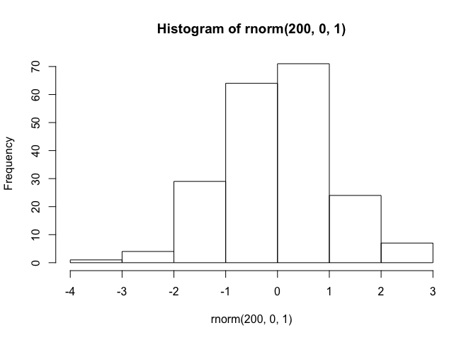

<!-- README.md is generated from README.Rmd. Please edit that file -->
fudukue (文机)
==============

`fukudue` is a R package developed to support literate programming with R mainly for the author. This package will be used in conjunction with [`knitr`]() and [`bookdown`]().

Installation
------------

You can install:

-   the latest development version from github with

``` r
# install.packages("devtools") # if not installed
devtools::install_github("KeachMurakami/fudukue")
```

How to use
----------

### consistent cross-references displayed in .pfd and .docx

-   [demo](https://github.com/KeachMurakami/fudukue/tree/master/demo/cross-reference)

`fudukue` implements the following verbs for generate consistent cross-reference both in .pdf and .docx (described in reference\_switch.R).

-   `initialize_ref()`
    -   setup lookup table
-   `update_ref()`
    -   add id to newly called object.
-   `ref_eqn(), ref_fig(), ref_table()`
    -   generate continuous numbering from the given id.

``` r
library(fudukue)
library(tidyverse)
#> Warning: package 'tidyverse' was built under R version 3.3.2
#> Loading tidyverse: ggplot2
#> Loading tidyverse: tibble
#> Loading tidyverse: tidyr
#> Loading tidyverse: readr
#> Loading tidyverse: purrr
#> Loading tidyverse: dplyr
#> Warning: package 'tibble' was built under R version 3.3.2
#> Warning: package 'tidyr' was built under R version 3.3.2
#> Conflicts with tidy packages ----------------------------------------------
#> filter(): dplyr, stats
#> lag():    dplyr, stats

initialize_ref(list_name = "fig", max_object_num = 5)

# fig 1
plot(1:10)
```


``` r

update_ref(id = "one2ten", list_name = "fig")

# fig 2
hist(rnorm(200, 0, 1))
```



``` r

update_ref(id = "hist", list_name = "fig")


# for latex output
out_type <- "latex"
ref_fig(id = "hist", prefix = "Fig. ")
#> [1] "Fig. \\ref{fig:hist}"

# for docx output
out_type <- "docx"
ref_fig(id = "hist", prefix = "Fig. ")
#> [1] "Fig. 2"
```

Session information
-------------------

``` r
devtools::session_info()
#> Session info --------------------------------------------------------------
#>  setting  value                       
#>  version  R version 3.3.1 (2016-06-21)
#>  system   x86_64, darwin13.4.0        
#>  ui       X11                         
#>  language (EN)                        
#>  collate  en_US.UTF-8                 
#>  tz       Asia/Tokyo                  
#>  date     2017-07-08
#> Packages ------------------------------------------------------------------
#>  package    * version date       source                                
#>  assertthat   0.1     2013-12-06 CRAN (R 3.3.1)                        
#>  backports    1.0.4   2016-10-24 cran (@1.0.4)                         
#>  broom        0.4.1   2016-06-24 CRAN (R 3.3.0)                        
#>  cellranger   1.1.0   2016-07-27 cran (@1.1.0)                         
#>  colorspace   1.2-6   2015-03-11 CRAN (R 3.3.1)                        
#>  DBI          0.4-1   2016-05-08 CRAN (R 3.3.1)                        
#>  devtools     1.12.0  2016-06-24 CRAN (R 3.3.0)                        
#>  digest       0.6.11  2017-01-03 cran (@0.6.11)                        
#>  dplyr      * 0.5.0   2016-06-24 CRAN (R 3.3.0)                        
#>  evaluate     0.10    2016-10-11 cran (@0.10)                          
#>  forcats      0.2.0   2017-01-23 CRAN (R 3.3.2)                        
#>  fudukue    * 0.1.0   2017-07-08 Github (KeachMurakami/fudukue@42ef2b7)
#>  ggplot2    * 2.1.0   2016-03-01 url                                   
#>  gtable       0.2.0   2016-02-26 CRAN (R 3.3.1)                        
#>  haven        1.0.0   2016-09-23 CRAN (R 3.3.0)                        
#>  hms          0.3     2016-11-22 CRAN (R 3.3.1)                        
#>  htmltools    0.3.5   2016-03-21 CRAN (R 3.3.1)                        
#>  httr         1.2.1   2016-07-03 CRAN (R 3.3.0)                        
#>  jsonlite     1.2     2016-12-31 cran (@1.2)                           
#>  knitr        1.15.1  2016-11-22 cran (@1.15.1)                        
#>  lattice      0.20-33 2015-07-14 CRAN (R 3.3.1)                        
#>  lubridate    1.6.0   2016-09-13 CRAN (R 3.3.0)                        
#>  magrittr     1.5     2014-11-22 CRAN (R 3.3.1)                        
#>  memoise      1.0.0   2016-01-29 CRAN (R 3.3.1)                        
#>  mnormt       1.5-4   2016-03-09 CRAN (R 3.3.0)                        
#>  modelr       0.1.0   2016-08-31 CRAN (R 3.3.0)                        
#>  munsell      0.4.3   2016-02-13 CRAN (R 3.3.1)                        
#>  nlme         3.1-128 2016-05-10 CRAN (R 3.3.1)                        
#>  plyr         1.8.4   2016-06-08 CRAN (R 3.3.1)                        
#>  psych        1.6.6   2016-06-28 CRAN (R 3.3.0)                        
#>  purrr      * 0.2.2   2016-06-18 CRAN (R 3.3.0)                        
#>  R6           2.2.0   2016-10-05 cran (@2.2.0)                         
#>  Rcpp         0.12.11 2017-05-22 cran (@0.12.11)                       
#>  readr      * 1.0.0   2016-08-03 CRAN (R 3.3.0)                        
#>  readxl       1.0.0   2017-04-18 cran (@1.0.0)                         
#>  reshape2     1.4.2   2016-10-22 cran (@1.4.2)                         
#>  rmarkdown    1.3     2016-12-21 cran (@1.3)                           
#>  rprojroot    1.2     2017-01-16 cran (@1.2)                           
#>  rvest        0.3.2   2016-06-17 CRAN (R 3.3.0)                        
#>  scales       0.4.1   2016-11-09 CRAN (R 3.3.2)                        
#>  stringi      1.1.2   2016-10-01 cran (@1.1.2)                         
#>  stringr      1.2.0   2017-02-18 cran (@1.2.0)                         
#>  tibble     * 1.3.0   2017-04-01 cran (@1.3.0)                         
#>  tidyr      * 0.6.1   2017-01-10 cran (@0.6.1)                         
#>  tidyverse  * 1.1.1   2017-01-27 cran (@1.1.1)                         
#>  withr        1.0.2   2016-06-20 CRAN (R 3.3.1)                        
#>  xml2         1.1.1   2017-01-24 cran (@1.1.1)                         
#>  yaml         2.1.14  2016-11-12 cran (@2.1.14)
```
